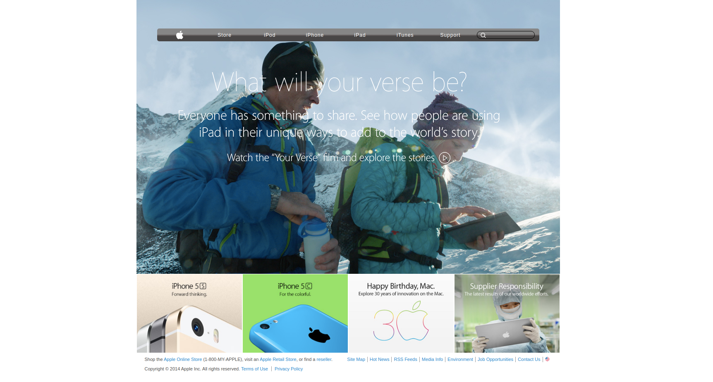

# Apple's Old Website

## Definition

We have used several techniques like flexbox, position and gradient to layout our and style our  website. And it's about apple's iphone 5 from apple's old website in archives.

## About the Project

This project is about building apple's old website from the archives while making use of flex, positioning and gradients.

The features of this project are listed as below:
1. Website has a header containing:
    - Navbar With  apple logo, menu links, input search
    - - Navbar has a linear gradient
    - Background image
    - banner links
2. Has a gallery
    - Images of apple products
    - The gallery items are links
3. Footer section with two main parts
    - The top footer
    - - The top footer contains sales links and uselful site links
    - The bottom footer
    - - The bottom footer contains terms, policy and rights

## Built With

- HTML5
- CSS3

## Live Demo

[Live Demo Link]()

## Getting Started

**Just clone this repo and open index.html file in your browser then you are good to go.**

**To get a local copy up and running follow these simple example steps.**

### clone the repo.

## Authors

👤 **Misori Simon**

  - GitHub: [Misori-simon](https://github.com/Misori-simon/)
  - Twitter: [@misori_simon](https://twitter.com/misori_simon)
  - LinkedIn: [Misori Simon](https://cm.linkedin.com/in/misori-simon-05906219b)

👤 **Dipesh Bajgain**

- GitHub: [@dipbazz](https://github.com/dipbazz)
- Twitter: [@dipbazz](https://twitter.com/dipbazz)
- LinkedIn: [Dipesh Bajgain](https://www.linkedin.com/in/dipbazz/)

## 🤝 Contributing

Contributions, issues, and feature requests are welcome!

## Show your support

Give a ⭐️ if you like this project!

## Acknowledgments

- icons and apple logo used from [iconify](https://iconify.design/)

## 📝 License

This project is [MIT](./LICENSE) licensed.
